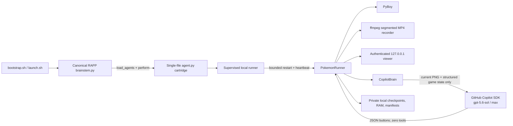

# RAPP Plays Pokémon

Run a real, single-file **RAPP cartridge** that lets GitHub Copilot autonomously
attempt a full playthrough of Pokémon Red in a local PyBoy emulator. It resumes
long-running progress, records segmented MP4 clips, exposes an authenticated
live viewer, and lets you take over at any time.

> [!IMPORTANT]
> This public repository is **ROM-free**. Supply your own legally obtained
> Pokémon Red Game Boy ROM. The project never downloads, searches for,
> distributes, or sends ROM/save bytes to GitHub, Copilot, or any cloud.

This is experimental. It **attempts a full playthrough** and is not guaranteed
to reach the Hall of Fame.

## Quickstart

### Local upload page

One clone plus one bootstrap command installs the app and opens a private local
setup page:

```bash
git clone https://github.com/kody-w/rapp-play-pokemon.git
cd rapp-play-pokemon
./bootstrap.sh
```

Choose a `.gb` file in the browser, or enter an existing absolute local path,
then select **Start autonomous playthrough**. The setup server listens only on
`127.0.0.1`.

### Direct local path

```bash
git clone https://github.com/kody-w/rapp-play-pokemon.git
cd rapp-play-pokemon
./bootstrap.sh --rom "$HOME/Games/Pokemon Red.gb"
```

Setup without launching:

```bash
./bootstrap.sh --setup-only
```

## Prerequisites

- macOS or Linux
- Python 3.11 or newer
- `git`
- [`ffmpeg`](https://ffmpeg.org/) (`brew install ffmpeg` on macOS)
- a GitHub account with an active Copilot entitlement
- GitHub Copilot SDK authentication available to the current user
- your own legally obtained Pokémon Red `.gb` ROM

Bootstrap creates `.venv`, resolves the canonical public
[`kody-w/RAPP`](https://github.com/kody-w/RAPP) brainstem at a reviewed commit,
installs `github-copilot-sdk>=1.0.6,<2`, `PyBoy>=2.6.1,<3`, and Pillow, downloads
the Copilot SDK runtime, registers the cartridge, and performs a ROM-free
discovery/invocation smoke test. It does not obtain game content.

## This is RAPP—not a generic skill

[`agent.py`](agent.py) is the actual cartridge. Its `CARTRIDGE_MANIFEST`,
`PokemonAgent.metadata`, deterministic implementation, and
`BasicAgent.perform(**kwargs) -> str` entry point all live in that one native
Python file.

Bootstrap does **not** vendor or rewrite a brainstem. It sparse-clones canonical
RAPP into ignored local storage at `.rapp/RAPP`, copies `agent.py` unchanged to
the discovery name `agents/rapp_play_pokemon_agent.py`, and invokes RAPP's
canonical `load_agents()` implementation. Every `launch.sh` lifecycle/control
command resolves the cartridge through that loader before calling `perform`.
The copied name is necessary because canonical brainstem discovers
`*_agent.py`; `agent.py` remains the source of truth.

Manual registration in an existing canonical kernel:

```bash
export RAPP_BRAINSTEM_DIR="/path/to/RAPP/cave/rapplications/rapp-installer/kernel"
python -m rapp_play_pokemon.brainstem \
  --source ./agent.py \
  --brainstem-dir "$RAPP_BRAINSTEM_DIR" \
  --smoke-runtime-dir ./.work-smoke
```

The cartridge retains an OpenRappter `BasicAgent` import fallback for
portability, but canonical RAPP brainstem is the primary and documented path.
For the OpenRappter-native distribution, see
[`kody-w/rappter-plays-pokemon`](https://github.com/kody-w/rappter-plays-pokemon).

## Architecture and data flow



The emulator pauses while a model decision is pending. A generation counter
discards stale decisions after manual takeover. The supervisor restarts failed
or stale children with bounded exponential backoff and opens a circuit after
repeated crashes.

## Commands and viewer controls

```bash
./launch.sh upload                                         # local setup page
./launch.sh start --rom "$HOME/Games/Pokemon Red.gb"      # start/resume
./launch.sh status                                         # progress
./launch.sh view                                           # authenticated viewer
./launch.sh pause                                          # freeze emulation
./launch.sh resume                                         # resume prior mode
./launch.sh manual                                         # take control
./launch.sh press up                                       # directions
./launch.sh press a                                        # a/b/start/select
./launch.sh autonomy                                       # return to Copilot
./launch.sh checkpoint                                     # save + rotate clip
./launch.sh stop                                           # checkpoint + clean stop
```

The browser viewer provides the same controls: takeover, autonomy, pause,
resume, eight Game Boy buttons, checkpoint/new clip, and stop. Use `--visible`
for PyBoy's native SDL window and `--no-open-viewer` to suppress browser launch.

Useful retention options:

```bash
./launch.sh start \
  --rom "$HOME/Games/Pokemon Red.gb" \
  --clip-minutes 10 \
  --max-clips 200 \
  --max-states 256 \
  --max-storage-gb 20 \
  --min-free-gb 2
```

Copy [`config.example.json`](config.example.json) to ignored `config.json`,
set local values, and pass `--config config.json` if preferred.

## Local upload and selection security

- The setup server binds a fixed `127.0.0.1` address, never `0.0.0.0`.
- A random bootstrap token establishes an HttpOnly, SameSite=Strict cookie.
- Every state-changing request requires that cookie, an exact loopback `Host`,
  and an exact same-origin `Origin`.
- Uploads require a declared length and are capped at 2 MiB; chunked bodies and
  multipart parsers are not accepted.
- Validation checks the Pokémon Red title, cartridge type, declared Game Boy
  ROM size, and header checksum before storage.
- Uploaded bytes go only to `~/.rapp/rapp-play-pokemon/rom/` with directory mode
  `0700` and file mode `0600`. A path selection is not copied.
- ROM bytes are never attached to a Copilot request, served by the viewer,
  logged, included in diagnostics, committed, or uploaded to GitHub.

Keep setup/viewer token URLs private. Do not reverse-proxy, port-forward, or
change the loopback bind.

## Runtime storage

Default private state is `~/.rapp/rapp-play-pokemon/` (`0700` directories and
`0600` private files).

| Path | Purpose |
| --- | --- |
| `rom/pokemon-red-upload.gb` | Browser-uploaded local copy, if used |
| `clips/*.mp4` | Completed local recording segments |
| `clips/*.json` | Clip hashes, timing, and game-state manifests |
| `states/*.state` | Atomic PyBoy checkpoints |
| `states/*.json` | Checkpoint hash and matching-ROM manifest |
| `pokemon-red-<hash>.ram` | ROM-scoped cartridge RAM |
| `screens/` | Bounded decision screenshots |
| `brain.json` | Recent decisions and progress context |
| `player.log` | Local supervisor/player diagnostics |
| `runtime-owner.json` | Safety marker required for explicit purge |

Path-based launch leaves the original ROM where it is. Resume validates ROM and
checkpoint hashes, skips corrupt/mismatched states, and falls back to the newest
valid checkpoint. Defaults retain 200 clips and 256 states, cap generated
artifacts at 20 GiB, and preserve 2 GiB free. Unknown files are not retention
targets; recording suspends rather than consuming the reserve.

## Privacy and security model

- **Inference isolation:** `CopilotClient(mode="empty")`, `available_tools=[]`,
  no skills/config discovery, no custom instructions, no session store,
  no telemetry, and no SDK memory.
- **Narrow model input:** only the current PNG screenshot and structured
  RAM-derived game state needed to choose buttons. GitHub's Copilot terms and
  privacy policy apply to those inference inputs.
- **Never model input:** ROM bytes, RAM/save files, checkpoints, clips, tokens,
  local paths, runtime JSON, and logs.
- **Authenticated viewer:** random process token, strict cookie, loopback Host
  checks, exact-Origin controls, CSP, no inline script, and safe clip filenames.
- **Public-repo guardrails:** case-insensitive ignores plus CI scanning reject
  game/runtime formats, secret filenames, likely credentials, and personal
  absolute paths.

No security boundary can make an untrusted ROM safe in every emulator. Use a
legally obtained image you trust, keep dependencies updated, and do not expose
the loopback services.

## Troubleshooting

### `ffmpeg is required`

Install ffmpeg, then rerun bootstrap:

```bash
brew install ffmpeg
./bootstrap.sh --setup-only
```

### Copilot SDK startup or authentication fails

Run the SDK runtime setup as the same OS user, then retry:

```bash
./.venv/bin/python -m copilot download-runtime
./launch.sh start --rom "$HOME/Games/Pokemon Red.gb"
```

Inspect the local `player.log`, but remove tokens, paths, screenshots, and game
state before sharing excerpts.

### ROM is rejected

Use an unmodified Pokémon Red Game Boy image with a valid header and `.gb`
extension. Download cloud-placeholder files locally first. This project cannot
obtain a ROM or determine whether your copy is lawful.

### Viewer or setup says `forbidden`

Open the service through `./launch.sh view` or `./launch.sh upload`; a bare port
cannot mint an authenticated cookie. Restarting invalidates old URLs.

### A stale process keeps restarting

```bash
./launch.sh stop
./launch.sh status
```

## Updates

Fast-forward the public app and rerun setup. Existing saves remain outside the
checkout:

```bash
git pull --ff-only
./bootstrap.sh --setup-only
```

`RAPP_REF` is pinned in `bootstrap.sh` for reproducibility. Maintainers update
it only after reviewing and smoke-testing the canonical contract.

## Uninstall

Remove the local environment and canonical checkout while preserving saves,
recordings, and uploaded game content:

```bash
./uninstall.sh
```

Delete all app-owned local data only when explicitly intended:

```bash
./uninstall.sh --purge-data
```

Purge requires a matching ownership marker and refuses unsafe directories.

## Development and validation

```bash
python3.11 -m venv .venv-dev
.venv-dev/bin/pip install -e ".[dev]"
.venv-dev/bin/ruff check .
.venv-dev/bin/python -m compileall -q agent.py src tests scripts
.venv-dev/bin/pytest
bash -n bootstrap.sh launch.sh uninstall.sh
.venv-dev/bin/python -m build
.venv-dev/bin/python scripts/check_public_artifacts.py
```

Tests and CI use only generated in-memory synthetic headers and mocks. They do
not track a synthetic `.gb`, require credentials, call Copilot, launch a GUI,
or use a commercial ROM.

## License and trademarks

Code is available under the [MIT License](LICENSE). Pokémon and related names
are trademarks of their respective owners. This independent project is not
affiliated with or endorsed by Nintendo, The Pokémon Company, Game Freak,
GitHub, RAPP, or PyBoy.
